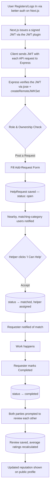

<div align="center">

# ThikAche

### "Post korlam... tarpor?"

A closed-loop, community-driven platform where people post small everyday help requests — a tech fix, tutoring, errands, moving help — and neighbors accept, complete, and get rated for them.

**Post it. Get matched. Get it done. Build trust.**

[Live Demo](https://thik-ache.vercel.app) · [Frontend Repo](https://github.com/SyntaxAdil) · [Backend Repo](https://github.com/SyntaxAdil/thik-ache-server)

</div>

---

## Overview

Existing job portals are built for long-term employment. They aren't built for the small, immediate things people actually need help with — fixing a laptop, an hour of tutoring, moving a couch, running an errand. ThikAche solves that with a simple, self-contained loop that doesn't depend on any third party to resolve:

```
Post Request → Nearby Helpers Notified → Helper Accepts (Matched)
     → Work Happens → Requester Marks Complete
          → Both Parties Review Each Other → Reputation Score Updates
```

Every request reaches a definite end state — no unresolved loops, no external authority needed.

---

## Live Demo & Credentials

**Live URL:** [thik-ache.vercel.app](https://thik-ache.vercel.app)

| Role | Email | Password |
|---|---|---|
| Requester | `demo.requester@thikache.app` | `Demo@1234` |
| Helper | `demo.helper@thikache.app` | `Demo@1234` |
| Admin | `admin@thikache.app` | `Admin@1234` |

Or use the **"Demo as Requester"** / **"Demo as Helper"** buttons on the login page for one-click access.

---

## Key Features

**For everyone**
- Public, filterable Explore page — search by keyword, category, and area, with sorting (Newest, Nearest, Most Urgent) and page-based pagination
- Public request details page — no login required to view
- Fully responsive design across mobile, tablet, and desktop

**For registered users**
- Email/password and Google OAuth login via better-auth
- Post a help request with category, location, preferred time, and optional budget
- Accept ("I Can Help") on open requests from other users
- Manage Requests dashboard — separate views for "Posted by Me" and "I'm Helping With"
- Mark requests complete, cancel unmatched requests
- Two-way review system — both requester and helper rate each other after completion
- In-app notifications on match, completion, and new reviews

**For admins**
- Dedicated admin dashboard with analytics (total requests, completion rate, active helpers, response times)
- Full user management
- Moderation controls to remove listings

---

## Tech Stack

### Frontend
- **Next.js 16** (App Router, Turbopack) + **React 19** + **TypeScript**
- **Tailwind CSS 4** (CSS-first config, OKLCH colors)
- **shadcn/ui** (Radix-based components)
- **Zod** for shared validation schemas
- **Recharts** for admin analytics
- **Leaflet + react-leaflet** for the nearby-requests map view
- **Sonner** for toast notifications

### Backend
- **Node.js 22** + **Express 5** — a standalone API layer, fully decoupled from the frontend's auth system
- **Mongoose 9** over **MongoDB Atlas**, with `2dsphere` geospatial indexing for location-based queries
- **jose** (`createRemoteJWKSet` + `jwtVerify`) for stateless JWT verification

### Authentication
- **better-auth** (email/password + Google OAuth), installed only in the Next.js app
- better-auth's JWT plugin issues short-lived, signed JWTs (EdDSA/Ed25519)
- The Express backend never installs better-auth or touches its user/session collections — it fetches Next.js's public JWKS endpoint and verifies incoming tokens independently

This split keeps the Express API auth-agnostic: easier to reason about, test in isolation, and swap out later without touching how users sign in.

---

## Architecture



Route-level protection is handled by Next.js's `proxy.ts`, checking the better-auth session for pages like `/requests/add` and `/dashboard`. Every mutating API route on the Express side independently re-verifies the JWT and re-checks role/ownership — the client's role claims are never trusted on their own.

---

## Authorization Matrix

| Action | Guest | Requester (owner) | Helper (matched) | Any logged-in user | Admin |
|---|:---:|:---:|:---:|:---:|:---:|
| View request details | ✅ | ✅ | ✅ | ✅ | ✅ |
| Post a request | ❌ | — | — | ✅ | ✅ |
| Accept ("I Can Help") | ❌ | ❌ | — | ✅ | ✅ |
| Mark complete | ❌ | ✅ | ❌ | ❌ | ✅ |
| Cancel request | ❌ | ✅ (if not matched) | ❌ | ❌ | ✅ |
| Leave a review | ❌ | ✅ (post-completion) | ✅ (post-completion) | ❌ | ❌ |
| Remove any listing | ❌ | ❌ | ❌ | ❌ | ✅ |

---

## Data Models

**User** — profile info, role (`user` / `admin`), geolocation, average ratings as helper/requester, completed-request count

**HelpRequest** — title, descriptions, category, geolocation + area label, optional budget, preferred time, status (`open` → `matched` → `in_progress` → `completed` / `cancelled`), poster and helper references

**Review** — linked to a request, rating (1–5), comment, and direction (requester → helper or helper → requester)

**Notification** — user-scoped, typed (`matched`, `completed`, `reviewed`, `new_nearby_request`), read state

Geospatial (`2dsphere`) indexes power location-based matching and search; a text index on request titles/descriptions powers full-text search; a compound index on status, category, and area keeps filtered listing queries fast.

---

## Notification Strategy

Real-time infrastructure (Socket.io/Pusher) was deliberately left out of this version to keep scope tight and reliable:

1. **In-app (core):** notifications are stored per-user and polled on an interval, surfaced via a bell-icon dropdown and toast on arrival
2. **Email (optional):** transactional emails on key events like a match or completion
3. **Real-time:** intentionally out of scope for this version — a natural next step for a v2 upgrade

---

## Author

**Md. Abdur Rahman**

- GitHub: [@SyntaxAdil](https://github.com/SyntaxAdil)
- Portfolio: [abdur-rahman-dev.vercel.app](https://abdur-rahman-dev.vercel.app)